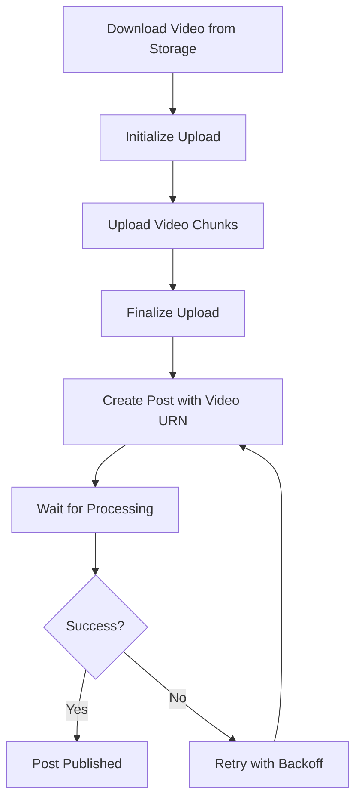

# LinkedIn Video API Implementation Guide

## Overview

This guide documents the complete implementation of LinkedIn video publishing using LinkedIn's REST API (version 202602). The implementation handles video upload, processing, and post creation with proper error handling and retry logic.

---

## Table of Contents

1. [API Prerequisites](#api-prerequisites)
2. [Authentication](#authentication)
3. [Video Upload Flow](#video-upload-flow)
4. [Implementation Details](#implementation-details)
5. [Error Handling](#error-handling)
6. [Testing](#testing)

---

## API Prerequisites

### Required LinkedIn API Access

- **API Version**: 202602 (February 2026)
- **Base URL**: `https://api.linkedin.com/rest/`
- **Protocol Version**: `X-Restli-Protocol-Version: 2.0.0`
- **Required Permissions**:
  - `w_member_social` - Post, comment and react as a member
  - `r_liteprofile` - Read basic profile information

### Required Headers for All Requests

```http
Authorization: Bearer {access_token}
Content-Type: application/json
LinkedIn-Version: 202602
X-Restli-Protocol-Version: 2.0.0
```

---

## Authentication

### OAuth 2.0 Flow

LinkedIn uses OAuth 2.0 for authentication. You need:

1. **Client ID** and **Client Secret** from LinkedIn Developer Portal
2. **Redirect URI** configured in your app settings
3. **Access Token** obtained through OAuth flow

### Storing Credentials

```go
type SocialAccount struct {
    Platform        string    // "linkedin"
    PlatformUserID  string    // LinkedIn member ID (e.g., "4Qt4HSzzfU")
    AccessToken     string    // OAuth access token
    RefreshToken    string    // OAuth refresh token
    TokenExpiresAt  time.Time // Token expiration
}
```

### Owner URN Format

LinkedIn uses URNs (Uniform Resource Names) to identify entities:

```go
ownerURN := fmt.Sprintf("urn:li:person:%s", platformUserID)
// Example: "urn:li:person:4Qt4HSzzfU"
```

---

## Video Upload Flow

The LinkedIn video publishing process has 5 main steps:



---

## Implementation Details

### Step 1: Download Video from Storage

First, download the video file from your storage (R2, S3, etc.):

```go
// Get video URL from database
var videoURL string
var fileSize int64
var mimeType string

if videoMedia.MediaFile != nil {
    videoURL = videoMedia.MediaFile.URL
    fileSize = videoMedia.MediaFile.Size
    mimeType = videoMedia.MediaFile.MimeType
}

// Download video
resp, err := http.Get(videoURL)
if err != nil {
    return PublishResult{
        Success: false,
        Error: fmt.Sprintf("Failed to download video: %v", err),
    }
}
defer resp.Body.Close()

videoData, err := io.ReadAll(resp.Body)
if err != nil {
    return PublishResult{
        Success: false,
        Error: fmt.Sprintf("Failed to read video data: %v", err),
    }
}

actualSize := len(videoData)
fmt.Printf("Video downloaded: %d bytes\n", actualSize)
```

---

### Step 2: Initialize Video Upload

Initialize the upload session with LinkedIn:

**Endpoint**: `POST /rest/videos?action=initializeUpload`

**Request Payload**:

```json
{
  "initializeUploadRequest": {
    "owner": "urn:li:person:{platformUserID}",
    "fileSizeBytes": 8938193,
    "uploadCaptions": false,
    "uploadThumbnail": false
  }
}
```

**Implementation**:

```go
initURL := "https://api.linkedin.com/rest/videos?action=initializeUpload"
ownerURN := fmt.Sprintf("urn:li:person:%s", platform.SocialAccount.PlatformUserID)

initPayload := map[string]interface{}{
    "initializeUploadRequest": map[string]interface{}{
        "owner":           ownerURN,
        "fileSizeBytes":   int64(actualSize),
        "uploadCaptions":  false,
        "uploadThumbnail": false,
    },
}

initData, _ := json.Marshal(initPayload)
initReq, _ := http.NewRequest("POST", initURL, bytes.NewBuffer(initData))

initReq.Header.Set("Authorization", fmt.Sprintf("Bearer %s", accessToken))
initReq.Header.Set("Content-Type", "application/json")
initReq.Header.Set("LinkedIn-Version", "202602")
initReq.Header.Set("X-Restli-Protocol-Version", "2.0.0")

client := &http.Client{Timeout: 60 * time.Second}
initResp, _ := client.Do(initReq)
```

**Response**:

```json
{
  "value": {
    "uploadInstructions": [
      {
        "uploadUrl": "https://...",
        "firstByte": 0,
        "lastByte": 4194303
      },
      {
        "uploadUrl": "https://...",
        "firstByte": 4194304,
        "lastByte": 8388607
      },
      {
        "uploadUrl": "https://...",
        "firstByte": 8388608,
        "lastByte": 8938192
      }
    ],
    "video": "urn:li:video:D4D10AQEyFItqpbnHIg",
    "uploadToken": ""
  }
}
```

**Parse Response**:

```go
var initResult struct {
    Value struct {
        UploadInstructions []struct {
            UploadURL string `json:"uploadUrl"`
            FirstByte int64  `json:"firstByte"`
            LastByte  int64  `json:"lastByte"`
        } `json:"uploadInstructions"`
        Video       string `json:"video"`
        UploadToken string `json:"uploadToken"`
    } `json:"value"`
}

json.Unmarshal(initBody, &initResult)

videoURN := initResult.Value.Video
uploadToken := initResult.Value.UploadToken
uploadInstructions := initResult.Value.UploadInstructions
```

---

### Step 3: Upload Video Chunks

Upload each chunk to the provided URLs:

**Implementation**:

```go
uploadClient := &http.Client{Timeout: 300 * time.Second}
uploadedPartIds := []string{}

for i, instr := range uploadInstructions {
    fmt.Printf("Uploading chunk %d/%d (%d to %d bytes)\n",
        i+1, len(uploadInstructions), instr.FirstByte, instr.LastByte)

    // Extract chunk data
    start := instr.FirstByte
    end := instr.LastByte + 1
    if end > int64(len(videoData)) {
        end = int64(len(videoData))
    }
    chunkData := videoData[start:end]

    // Upload chunk
    uploadReq, _ := http.NewRequest("PUT", instr.UploadURL, bytes.NewReader(chunkData))
    uploadReq.Header.Set("Content-Type", "application/octet-stream")
    uploadReq.Header.Set("Authorization", fmt.Sprintf("Bearer %s", accessToken))
    uploadReq.ContentLength = int64(len(chunkData))

    uploadResp, _ := uploadClient.Do(uploadReq)

    // Get ETag from response (this is the part ID)
    etag := uploadResp.Header.Get("ETag")
    etag = strings.Trim(etag, "\"")

    uploadResp.Body.Close()

    if etag != "" {
        uploadedPartIds = append(uploadedPartIds, etag)
    }

    fmt.Printf("Chunk %d uploaded, ETag: %s\n", i+1, etag)
}
```

**Important Notes**:

- Each chunk must be uploaded via `PUT` request
- The `ETag` header from the response is the part ID needed for finalization
- Chunks are uploaded in parallel by LinkedIn's infrastructure

---

### Step 4: Finalize Upload

Finalize the upload to signal completion:

**Endpoint**: `POST /rest/videos?action=finalizeUpload`

**Request Payload**:

```json
{
  "finalizeUploadRequest": {
    "video": "urn:li:video:D4D10AQEyFItqpbnHIg",
    "uploadToken": "",
    "uploadedPartIds": [
      "/ambry-video/signedId/AQKI5RMabCX60QAAAZx7JbwdjcSWB4GqTbj...",
      "/ambry-video/signedId/AQKtz3rQDK3C4gAAAZx7JlirLrpbgPHiETVy...",
      "/ambry-video/signedId/AQJXbkj_Z-trdQAAAZx7JmjB5RlMkN7mNwLc..."
    ]
  }
}
```

**Implementation**:

```go
finalizeURL := "https://api.linkedin.com/rest/videos?action=finalizeUpload"

finalizePayload := map[string]interface{}{
    "finalizeUploadRequest": map[string]interface{}{
        "video":           videoURN,
        "uploadToken":     uploadToken,
        "uploadedPartIds": uploadedPartIds, // REQUIRED
    },
}

finalizeData, _ := json.Marshal(finalizePayload)
finalizeReq, _ := http.NewRequest("POST", finalizeURL, bytes.NewBuffer(finalizeData))

finalizeReq.Header.Set("Authorization", fmt.Sprintf("Bearer %s", accessToken))
finalizeReq.Header.Set("Content-Type", "application/json")
finalizeReq.Header.Set("LinkedIn-Version", "202602")
finalizeReq.Header.Set("X-Restli-Protocol-Version", "2.0.0")

client := &http.Client{Timeout: 60 * time.Second}
finalizeResp, _ := client.Do(finalizeReq)
```

**Response**: `200 OK` (empty body)

---

### Step 5: Create Post with Video

Create the LinkedIn post with the video URN:

**Endpoint**: `POST /rest/posts`

**Request Payload**:

```json
{
  "author": "urn:li:person:4Qt4HSzzfU",
  "commentary": "Your post content here...",
  "visibility": "PUBLIC",
  "distribution": {
    "feedDistribution": "MAIN_FEED",
    "targetEntities": [],
    "thirdPartyDistributionChannels": []
  },
  "content": {
    "media": {
      "id": "urn:li:video:D4D10AQEyFItqpbnHIg"
    }
  },
  "lifecycleState": "PUBLISHED",
  "isReshareDisabledByAuthor": false
}
```

**Implementation**:

```go
postURL := "https://api.linkedin.com/rest/posts"

postPayload := map[string]interface{}{
    "author":      ownerURN,
    "commentary":  content,
    "visibility":  "PUBLIC",
    "distribution": map[string]interface{}{
        "feedDistribution": "MAIN_FEED",
        "targetEntities":   []interface{}{},
        "thirdPartyDistributionChannels": []interface{}{},
    },
    "content": map[string]interface{}{
        "media": map[string]interface{}{
            "id": videoURN,
        },
    },
    "lifecycleState": "PUBLISHED",
    "isReshareDisabledByAuthor": false,
}

postData, _ := json.Marshal(postPayload)
postReq, _ := http.NewRequest("POST", postURL, bytes.NewBuffer(postData))

postReq.Header.Set("Authorization", fmt.Sprintf("Bearer %s", accessToken))
postReq.Header.Set("Content-Type", "application/json")
postReq.Header.Set("LinkedIn-Version", "202602")
postReq.Header.Set("X-Restli-Protocol-Version", "2.0.0")

client := &http.Client{Timeout: 60 * time.Second}
postResp, _ := client.Do(postReq)
```

**Response**:

```json
{
  "id": "urn:li:share:7234567890123456789"
}
```

---

## Error Handling

### Common Errors and Solutions

#### 1. "One or more of the contents is not owned by the author"

**Cause**: Video is still processing on LinkedIn's servers

**Solution**: Implement retry logic with exponential backoff

```go
waitTimes := []int{120, 300, 600, 1200} // 2min, 5min, 10min, 20min

for attempt := 0; attempt < len(waitTimes); attempt++ {
    if attempt > 0 {
        waitTime := waitTimes[attempt-1]
        fmt.Printf("Waiting %d minutes before retry %d/%d...\n",
            waitTime/60, attempt+1, len(waitTimes))
        time.Sleep(time.Duration(waitTime) * time.Second)
    }

    result := createLinkedInVideoPost(post, platform, videoURN, ownerURN)

    if result.Success {
        return result
    }

    if strings.Contains(result.Error, "not owned by the author") {
        continue // Retry
    }

    return result // Different error, fail immediately
}
```

#### 2. Video URN Persistence

**Problem**: If post creation fails, you need to retry without re-uploading

**Solution**: Save video URN to metadata

```go
// Save video URN after successful upload
metadata := map[string]interface{}{
    "linkedin_video_urn": videoURN,
    "upload_attempts": 0,
}
metadataJSON, _ := json.Marshal(metadata)
platform.Metadata = string(metadataJSON)
db.Model(platform).Update("metadata", string(metadataJSON))

// Reuse on retry
if platform.Metadata != "" {
    var metadata map[string]interface{}
    if err := json.Unmarshal([]byte(platform.Metadata), &metadata); err == nil {
        if videoURN, ok := metadata["linkedin_video_urn"].(string); ok && videoURN != "" {
            // Skip upload, go directly to post creation
            return createLinkedInVideoPostWithRetry(post, platform, videoURN, ownerURN, 0)
        }
    }
}
```

#### 3. Chunk Upload Failures

**Solution**: Retry individual chunks

```go
maxChunkRetries := 3
for chunkAttempt := 0; chunkAttempt < maxChunkRetries; chunkAttempt++ {
    if chunkAttempt > 0 {
        backoff := time.Duration(chunkAttempt) * 2 * time.Second
        time.Sleep(backoff)
    }

    uploadResp, err := uploadClient.Do(uploadReq)
    if err != nil {
        continue
    }

    if uploadResp.StatusCode == http.StatusOK || uploadResp.StatusCode == http.StatusCreated {
        break // Success
    }
}
```

---

## Testing

### Test Video Upload

```bash
# 1. Ensure you have a valid access token
export LINKEDIN_ACCESS_TOKEN="your_access_token"

# 2. Create a test post with video
curl -X POST http://localhost:8080/api/workspaces/{workspace_id}/posts \
  -H "Authorization: Bearer {your_jwt_token}" \
  -H "Content-Type: application/json" \
  -d '{
    "content": "Test video post",
    "status": "published",
    "scheduled_at": null,
    "platforms": ["linkedin"],
    "media_ids": [57]
  }'

# 3. Monitor logs for upload progress
docker-compose logs -f api
```

### Expected Log Output

```
Publishing LinkedIn video: URL=https://..., Size=8938193, Type=video/mp4
Downloading video from storage...
Video downloaded successfully: 8938193 bytes
Initializing LinkedIn video upload...
Owner URN: urn:li:person:4Qt4HSzzfU
LinkedIn upload initialized: URN=urn:li:video:D4D10AQEyFItqpbnHIg, Chunks=3
Uploading video chunks to LinkedIn...
Uploading chunk 1/3 (0 to 4194303 bytes)
Chunk 1 uploaded successfully, ETag: /ambry-video/signedId/...
Uploading chunk 2/3 (4194304 to 8388607 bytes)
Chunk 2 uploaded successfully, ETag: /ambry-video/signedId/...
Uploading chunk 3/3 (8388608 to 8938192 bytes)
Chunk 3 uploaded successfully, ETag: /ambry-video/signedId/...
Finalizing LinkedIn video upload...
Upload finalized successfully
Saved video URN to platform metadata: urn:li:video:D4D10AQEyFItqpbnHIg
Creating LinkedIn post with video URN...
Post created successfully! ID: urn:li:share:7234567890123456789
```

---

## Key Differences: Old vs New API

### Old UGC API (Deprecated)

```go
// ❌ OLD - Don't use
postURL := "https://api.linkedin.com/v2/ugcPosts"
payload := map[string]interface{}{
    "author": "urn:li:person:123",
    "lifecycleState": "PUBLISHED",
    "specificContent": map[string]interface{}{
        "com.linkedin.ugc.ShareContent": map[string]interface{}{
            "shareCommentary": map[string]interface{}{
                "text": content,
            },
            "shareMediaCategory": "VIDEO",
            "media": []map[string]interface{}{
                {
                    "status": "READY",
                    "media": videoURN,
                },
            },
        },
    },
}
```

### New REST API (Current)

```go
// ✅ NEW - Use this
postURL := "https://api.linkedin.com/rest/posts"
payload := map[string]interface{}{
    "author": "urn:li:person:123",
    "commentary": content,
    "visibility": "PUBLIC",
    "content": map[string]interface{}{
        "media": map[string]interface{}{
            "id": videoURN,
        },
    },
    "lifecycleState": "PUBLISHED",
}
```

---

## Best Practices

1. **Always use the latest API version** (202602 as of Feb 2026)
2. **Implement retry logic** for video processing delays
3. **Save video URN** to avoid re-uploading on retry
4. **Use proper timeout values** (60s for API calls, 300s for uploads)
5. **Log all steps** for debugging
6. **Handle rate limits** (LinkedIn has rate limits per app)
7. **Validate video format** before upload (MP4, max 5GB)
8. **Clean up metadata** after successful publish

---

## References

- [LinkedIn Marketing API Versioning](https://learn.microsoft.com/en-us/linkedin/marketing/versioning)
- [LinkedIn Posts API](https://learn.microsoft.com/en-us/linkedin/consumer/integrations/self-serve/share-on-linkedin)
- [LinkedIn Video Upload](https://learn.microsoft.com/en-us/linkedin/marketing/integrations/community-management/shares/video-posts)
- [OAuth 2.0 Authentication](https://learn.microsoft.com/en-us/linkedin/shared/authentication/authentication)

---

## Troubleshooting

### Video not appearing in post

- Check that video URN matches the uploaded video
- Verify owner URN matches the authenticated user
- Ensure video processing completed (wait 2-20 minutes)

### 401 Unauthorized

- Verify access token is valid and not expired
- Check that token has `w_member_social` permission
- Ensure LinkedIn-Version header is set correctly

### 400 Bad Request

- Validate JSON payload structure
- Check that all required fields are present
- Verify video URN format is correct

---

**Last Updated**: February 20, 2026  
**API Version**: 202602  
**Implementation**: Go (Golang)
